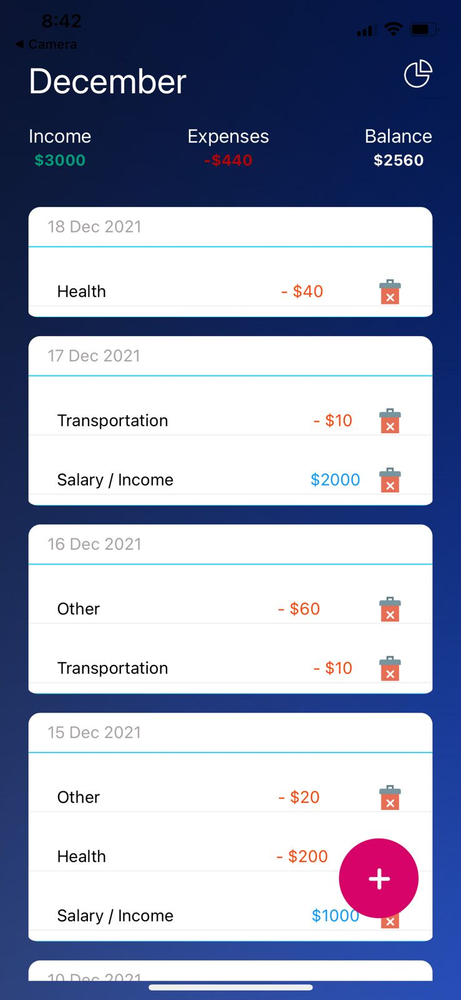
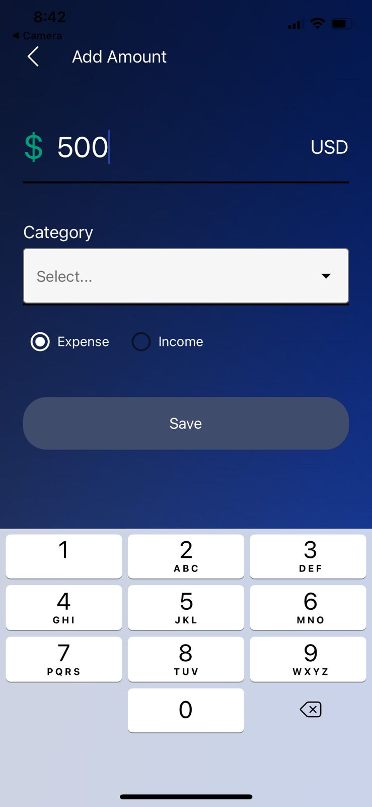
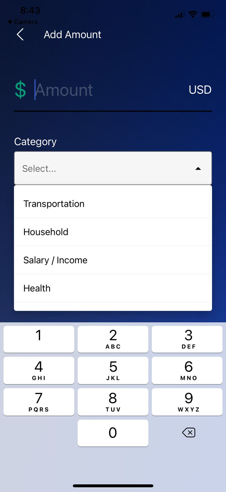
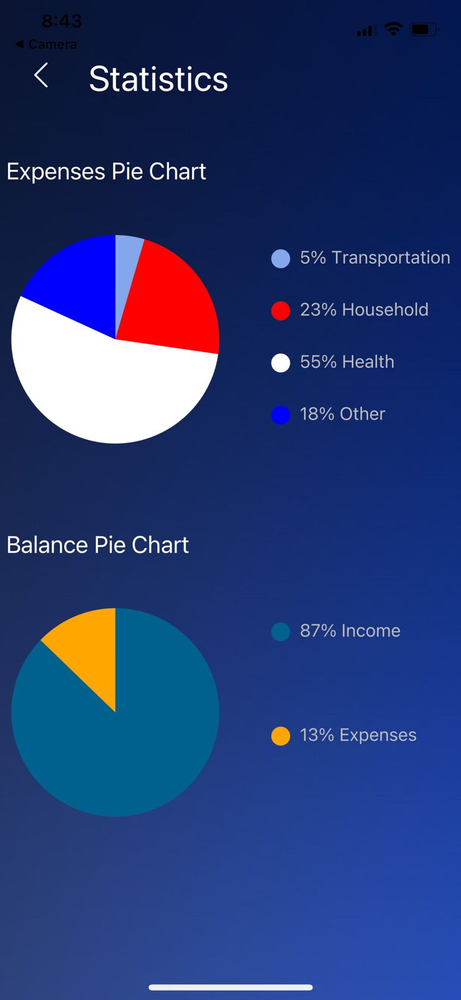

# React-Native-Expense-Tracker-App

Application designed to track the expenses we make on a daily basis, helpful and necessary to have healthy finances and a project in which I have learned a lot about react native

## How to run
Run `npm install` to install the required dependencies

Run `expo start` to run the app

## Screenshots
Transactions Page

Add Amount

Statistics

